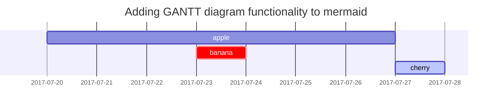

## 标题

<!-- markdownlint-capture -->
<!-- markdownlint-disable -->
# H1 — 一级标题
{: .mt-4 .mb-0 }

## H2 — 二级标题
{: data-toc-skip='' .mt-4 .mb-0 }

### H3 — 三级标题
{: data-toc-skip='' .mt-4 .mb-0 }

#### H4 — 四级标题
{: data-toc-skip='' .mt-4 }
<!-- markdownlint-restore -->

## 段落

Quisque egestas convallis ipsum, ut sollicitudin risus tincidunt a. Maecenas interdum malesuada egestas. Duis consectetur porta risus, sit amet vulputate urna facilisis ac. Phasellus semper dui non purus ultrices sodales. Aliquam ante lorem, ornare a feugiat ac, finibus nec mauris. Vivamus ut tristique nisi. Sed vel leo vulputate, efficitur risus non, posuere mi. Nullam tincidunt bibendum rutrum. Proin commodo ornare sapien. Vivamus interdum diam sed sapien blandit, sit amet aliquam risus mattis. Nullam arcu turpis, mollis quis laoreet at, placerat id nibh. Suspendisse venenatis eros eros.

## 列表

### 有序列表

1. 第一项
2. 第二项
3. 第三项

### 无序列表

- 章
  - 节
    - 段落

### 待办列表

- [ ] 任务
  - [x] 步骤 1
  - [x] 步骤 2
  - [ ] 步骤 3

### 定义列表

太阳
: 地球围绕其运行的恒星

月亮
: 地球的天然卫星，通过反射太阳光而被看见

## 引用块

> 这一行展示了_引用块_。

## 提示块

<!-- markdownlint-capture -->
<!-- markdownlint-disable -->
> 这是一个 `tip` 类型的提示示例。
{: .prompt-tip }

> 这是一个 `info` 类型的提示示例。
{: .prompt-info }

> 这是一个 `warning` 类型的提示示例。
{: .prompt-warning }

> 这是一个 `danger` 类型的提示示例。
{: .prompt-danger }
<!-- markdownlint-restore -->

## 表格

| 公司                         | 联系人           |   国家 |
| :--------------------------- | :--------------- | -----: |
| Alfreds Futterkiste          | Maria Anders     |   德国 |
| Island Trading               | Helen Bennett    |   英国 |
| Magazzini Alimentari Riuniti | Giovanni Rovelli | 意大利 |

## 链接

<http://127.0.0.1:4000>

## 脚注

点击标记即可跳转到脚注[^footnote]，这里还有另一个脚注[^fn-nth-2]。

## 行内代码

这是一个 `Inline Code`（行内代码）的示例。

## 文件路径

这是文件路径 `/path/to/the/file.extend`{: .filepath}。

## 代码块

### 普通代码块

<!-- markdownlint-disable-next-line MD040 -->
```
This is a common code snippet, without syntax highlight and line number.
```

### 指定语言

```bash
if [ $? -ne 0 ]; then
  echo "The command was not successful.";
  #do the needful / exit
fi;
```

### 指定文件名

```sass
@import
  "colors/light-typography",
  "colors/dark-typography";
```
{: file='_sass/jekyll-theme-chirpy.scss'}

## 数学公式

数学公式由 [**MathJax**](https://www.mathjax.org/) 提供支持：

$$
\begin{equation}
  \sum_{n=1}^\infty 1/n^2 = \frac{\pi^2}{6}
  \label{eq:series}
\end{equation}
$$

可以通过 \eqref{eq:series} 引用该公式。

当 $a \ne 0$ 时，方程 $ax^2 + bx + c = 0$ 有两个解，分别为

$$ x = {-b \pm \sqrt{b^2-4ac} \over 2a} $$

## Mermaid SVG 图表



## 图片

### 默认样式（带说明）

{: width="972" height="589" }
_全屏宽度，居中对齐_

### 左对齐

{: width="972" height="589" .w-75 .normal}

### 向左浮动

{: width="972" height="589" .w-50 .left}
Praesent maximus aliquam sapien. Sed vel neque in dolor pulvinar auctor. Maecenas pharetra, sem sit amet interdum posuere, tellus lacus eleifend magna, ac lobortis felis ipsum id sapien. Proin ornare rutrum metus, ac convallis diam volutpat sit amet. Phasellus volutpat, elit sit amet tincidunt mollis, felis mi scelerisque mauris, ut facilisis leo magna accumsan sapien. In rutrum vehicula nisl eget tempor. Nullam maximus ullamcorper libero non maximus. Integer ultricies velit id convallis varius. Praesent eu nisl eu urna finibus ultrices id nec ex. Mauris ac mattis quam. Fusce aliquam est nec sapien bibendum, vitae malesuada ligula condimentum.

### 向右浮动

{: width="972" height="589" .w-50 .right}
Praesent maximus aliquam sapien. Sed vel neque in dolor pulvinar auctor. Maecenas pharetra, sem sit amet interdum posuere, tellus lacus eleifend magna, ac lobortis felis ipsum id sapien. Proin ornare rutrum metus, ac convallis diam volutpat sit amet. Phasellus volutpat, elit sit amet tincidunt mollis, felis mi scelerisque mauris, ut facilisis leo magna accumsan sapien. In rutrum vehicula nisl eget tempor. Nullam maximus ullamcorper libero non maximus. Integer ultricies velit id convallis varius. Praesent eu nisl eu urna finibus ultrices id nec ex. Mauris ac mattis quam. Fusce aliquam est nec sapien bibendum, vitae malesuada ligula condimentum.

### 深浅色模式与阴影

下方图片会根据主题偏好切换深浅色模式，请注意图片还带有阴影。

{: .light .w-75 .shadow .rounded-10 w='1212' h='668' }
{: .dark .w-75 .shadow .rounded-10 w='1212' h='668' }

## 视频



## 脚注回跳

[^footnote]: 脚注正文
[^fn-nth-2]: 第二条脚注正文
