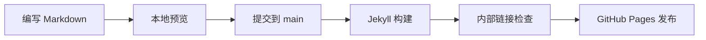

这篇文章在 Front Matter 中启用了 `math: true` 和 `mermaid: true`。

## 数学公式

平方和展开：

$$
(a+b)^2 = a^2 + 2ab + b^2
$$

公式用于解释推导过程。没有数学内容的文章可以省略 `math`。

## 发布流程

## 操作练习

把“本地预览”节点改成自己的步骤，再刷新页面。Mermaid 由浏览器渲染，需要加载相应脚本；如果图表没有出现，先检查网络和浏览器控制台。
